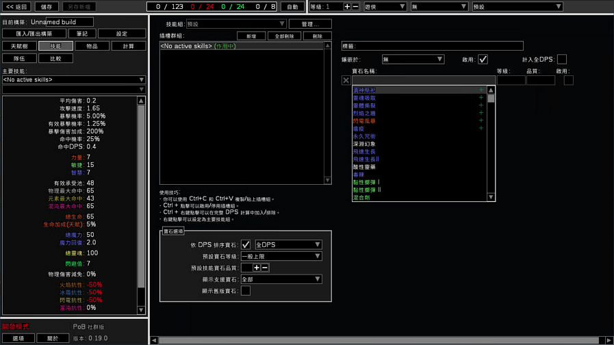

# Path of Building 2 — Chinese Localization (i18n)

[繁體中文說明請看 README.zh-TW.md](README.zh-TW.md)

A Chinese localization of
[Path of Building 2 Community](https://github.com/PathOfBuildingCommunity/PathOfBuilding-PoE2),
the popular build planner for Path of Exile 2.

- **Traditional Chinese (`zh_TW`)** — fully translated.
- **Simplified Chinese (`zh_CN`)** — partial demo only, not complete.



## What this really does

The hard part of localizing Path of Building was never the difficulty — it was
the sheer volume: tens of thousands of strings that no single maintainer can
realistically translate. That's understandable, and it's why upstream never
shipped translations.

This fork solves the part that actually needs a developer: it **adds the i18n
mechanism** — covering all three sides that a real localization needs:

- **Display** — UI, items, skills, passives, and stat lines render in the chosen
  language.
- **Input** — the input fields are patched so you can **type Chinese (CJK)
  directly** into search and name boxes — the base engine couldn't accept this
  before.
- **Search** — searching also matches the translated text, so you can find an
  item or skill by its Chinese name.

Once that mechanism exists, the translation itself becomes ordinary text-editing
work that **any user can do**, in any language, no programming required.

Chinese is just the first demonstration. The same mechanism opens the door for
every other language. The intent is for upstream to adopt the i18n layer so the
community can fill in translations from there.

---

## For players: just use it

A ready-to-run Windows build is attached to the
[latest Release](../../releases/latest). Download the `.zip`, unpack it, and run
Path of Building — no compiling required. Pick the language in the program's
settings.

The Chinese layer is **localization-only, not a data change**: the interface,
items, skills, passives and stat lines are shown in Chinese (and you can type and
search in Chinese), while your builds, import/export codes, and trade data stay
in the original English so they remain fully compatible with the upstream Path of
Building.

---

## For translators: how to fix or improve a translation

All wording lives in plain-text **PO files** — the standard translation format.
You don't need to know Lua or program internals to help; you only edit text.

### Where the text lives

```text
locale/zh_TW/LC_MESSAGES/    Traditional Chinese
locale/zh_CN/LC_MESSAGES/    Simplified Chinese (partial)

  pob.po        UI, menus, buttons, tooltips
  items.po      item names
  skills.po     skill / gem names
  passives.po   passive tree nodes
  stats.po      stat / modifier lines
```

### How to change a translation

1. Open the relevant `.po` file in any text editor (or a PO editor such as
   Poedit).
2. Find the English text under `msgid` and edit the Chinese under `msgstr`:

   ```po
   msgid "Total Life"
   msgstr "總生命"
   ```

3. Save the file.

### How to apply your change

PO files are compiled into the tables the program reads. After editing, run:

```bash
python3 scripts/compile-lang.py locale/zh_TW/LC_MESSAGES/pob.po src/Data/Lang/zh_TW/pob.lua
```

Repeat for whichever catalog you edited (`items`, `skills`, `passives`,
`stats`). To check a file is up to date without writing, add `--check`.

That's the whole loop: **edit the `.po`, run the compile script, done.** Then
rebuild or rerun the program to see your change.

### Contributing back

Fork this repo, commit your edited `.po` files (and the regenerated `.lua`
files), and open a pull request. Translation-only changes are welcome.

---

## For developers: building it yourself

This repo ships **source code only** — no compiled binaries or DLLs. You can
inspect every change and build it yourself, which is the point: nothing to
trust blindly.

The `release` branch has two commits:

```text
commit 1  -> pristine upstream clone (b8048682, unmodified English)
commit 2  -> the localization patch
```

View the second commit to see the entire localization diff against the clean
upstream snapshot. The patch is display-layer only; build data, import/export
payloads, trade values, and calculation internals are untouched.

Helper scripts under `scripts/` cover extraction, compilation, and audits of
translation coverage. The core one is `compile-lang.py` shown above.

---

## Upstream & license

Original project:
[PathOfBuildingCommunity/PathOfBuilding-PoE2](https://github.com/PathOfBuildingCommunity/PathOfBuilding-PoE2).
Upstream owns Path of Building 2 Community; this is an unofficial localization
fork. License: MIT — see [LICENSE.md](LICENSE.md).
